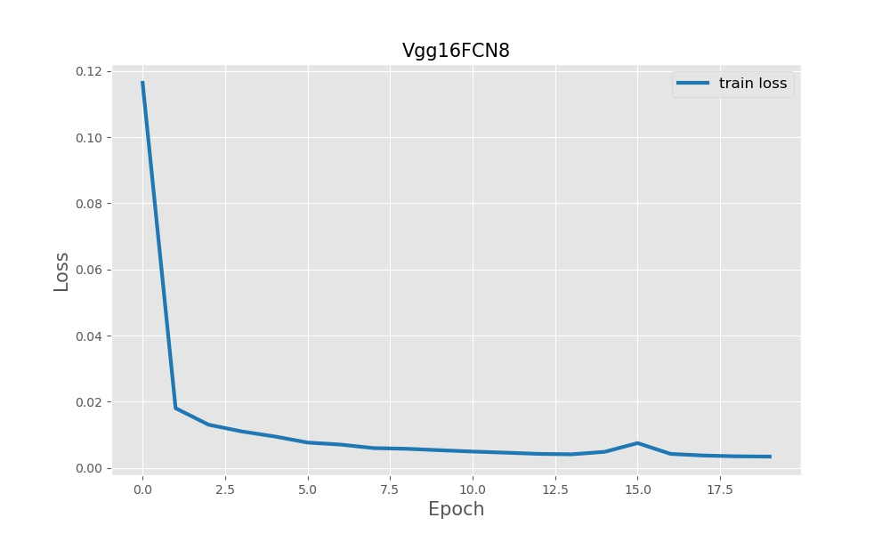
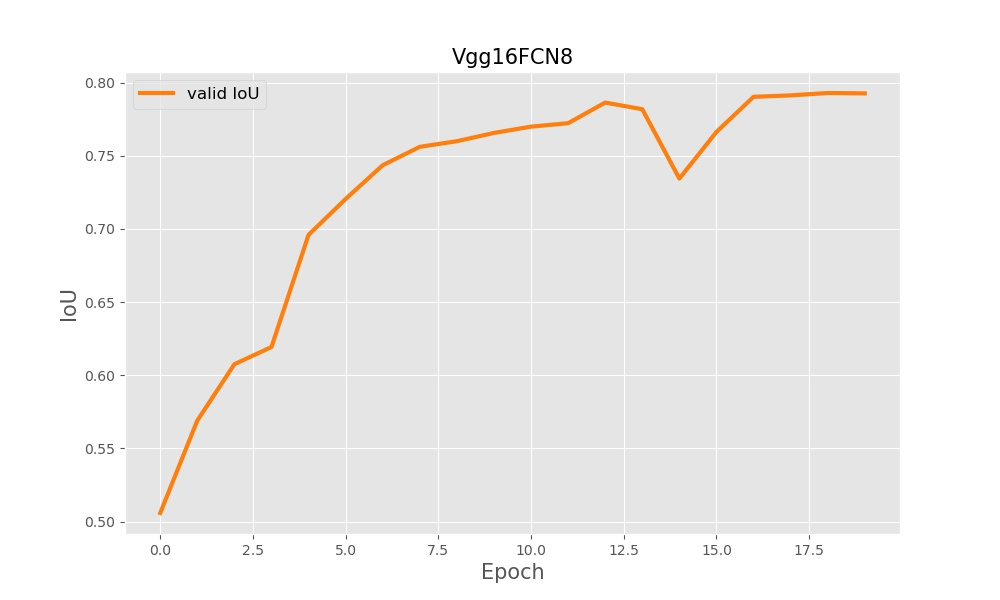
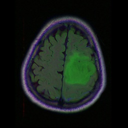
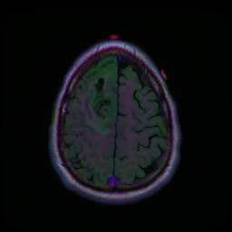
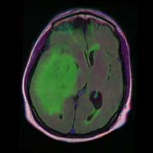
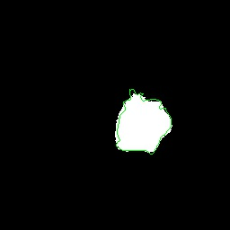
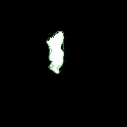
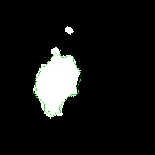

# Semantic Segmentation

A pytorch implementation of Vgg16FCN8s for semantic segmentation.

## Dataset

Dataset used for development and evaluation was available on Kaggle: [[kaggle.com/mateuszbuda/lgg-mri-segmentation]](https://www.kaggle.com/mateuszbuda/lgg-mri-segmentation).

## Usage

Training

```
python train.py <--epochs 20> <--batch_size 16> <--lr 0.0005>
```

Testing

```
python test.py  <--ckpt your_ckpt.pt>
```


|               Training Loss               |            Validation IoU            |
| :-----------------------------------------: | :-------------------------------------: |
|  |  |

## Model Performance


|   Model   | Mean IoU |
| :----------: | :--------: |
| Vgg16FCN8s |  0.8043  |

## Prediction Visualization

The withe area is model's prediction and the green line is the Ground Truth.


|          Testing image          | TCGA_CS_4943_20000902_16                             | TCGA_DU_8164_19970111_28                             | TCGA_CS_4944_20010208_11                             |
| :--------------------------------: | ------------------------------------------------------ | ------------------------------------------------------ | ------------------------------------------------------ |
|            MRI imgae            |          |          |          |
| Prediction and<br/> Ground Truth |  |  |  |
